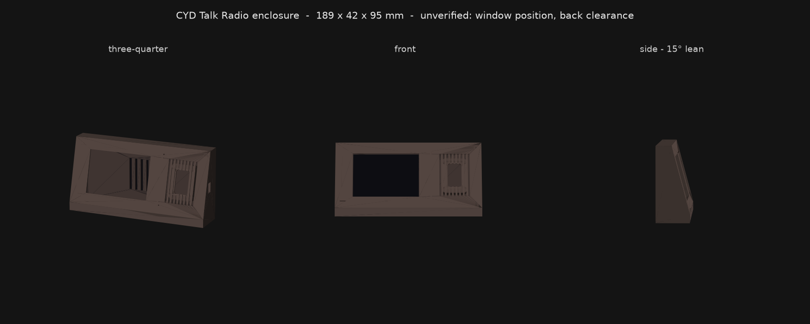

# Enclosure

A retro tabletop-radio case for the Hosyond ESP32-S3 4.0" board. Two printed
parts, four self-tapping screws, and a press-fit speaker. Nothing to cut, drill
or glue — the whole point is that it arrives finished from a print service.



Currently **170 × 43 × 99 mm**: the screen as the illuminated dial face, 15
printed grille slots beside it, an 11 mm plinth, and the front face leaning
back 15°.

## ⚠ Board dimensions are still placeholders

The PCB (112.6 × 60.98 mm), the speaker (40.62 × 28.06 × 9.71 mm) and the USB
opening (11.2 × 6.2 mm) are measured. **Two things are not, and one of them
will scrap a print:**

- **Window position.** The active area is 84.6 × 56.4 mm *derived* from a 4.0"
  3:2 panel, never measured, and it leaves 28 mm of spare PCB across the width
  against 4.6 mm across the height. So the display is almost certainly offset
  rather than centred, and `ACTIVE_DX` is currently 0. Wrong by 14 mm and the
  screen looks through solid plastic.
- **Back clearance.** `BACK_CLEAR` is still a guessed 13 mm. Too small and the
  case will not close.

The vendor was wrong about the panel size, the driver IC *and* the amp
polarity, so nothing here is taken from a datasheet either. Measure it.

| Parameter | Needed | Have |
|---|---|---|
| `BOARD_W` / `BOARD_H` | PCB outline | 112.6 × 60.98 — **measured** |
| `BOARD_T` | PCB thickness | placeholder (1.6) — low risk |
| `BACK_CLEAR` | PCB surface to highest point on the back, speaker plug fitted | **placeholder (13)** — too small and it will not close |
| `ACTIVE_W` / `ACTIVE_H` | panel active area | **derived**, not measured |
| `ACTIVE_DX` / `ACTIVE_DY` | active area offset from PCB centre | **assumed centred — probably wrong, see above** |
| `SPK_W` / `SPK_H` / `SPK_DEPTH` | speaker body | 40.62 × 28.06 × 9.71 — **measured** |
| `SPK_CORNER` | corner radius | eyeballed at 3.0; only affects pocket fit |
| `USB_EDGE` / `USB_POS` | which edge, and offset along it | **placeholder** |
| `USB_W` / `USB_H` | port opening | 11.2 × 6.2 — **measured** |

## Files

| | |
|---|---|
| `radio_case.py` | The model. All parameters at the top; everything else derives. |
| `render.py` | Shaded views of the exported STLs, into `preview.png`. |
| `stl/front.stl` | Body: tilted face, screen window, grille, speaker ring, bosses, USB slot. |
| `stl/back.stl` | Cover: vents, four screw holes, board pads. |

## Regenerating

Needs `trimesh` with the `manifold3d` boolean engine, plus `shapely` for the
2D profile extrusion and `matplotlib` for the render. A venv keeps it off the
system Python:

```bash
python3 -m venv /tmp/cadenv && /tmp/cadenv/bin/pip install trimesh manifold3d shapely numpy matplotlib
/tmp/cadenv/bin/python enclosure/radio_case.py && /tmp/cadenv/bin/python enclosure/render.py
```

Both parts print their bounding box and assert `watertight` on export. **Check
that.** A non-manifold STL is what a print service rejects, and the failure is
not always visible: an earlier version put the cover's screw holes exactly
tangent to the cover edge, leaving a zero-thickness sliver that a slicer would
likely have "repaired" into something subtly wrong rather than flagged.

`render.py` culls back faces itself, because matplotlib's 3D axes cannot — the
first render showed the inside of the case through its own screen window.

## How it holds the board

**No screws through the PCB.** The board drops into a printed pocket that
locates it in X and Y, and pads on the back cover hold it forward against the
inside of the front face. This removes the need to know where the mounting
holes are, and it avoids the boss-height trap: a self-tapper needs ~5 mm of
thread, which would otherwise push the board 5 mm behind the face and turn the
window into a tunnel.

The four screws join the two shell halves only, into bosses in the empty
corners.

## Printing

No supports required — the front face is a 75° wall, and the plinth gives the
body a flat base to sit on.

| | |
|---|---|
| Material | PLA is fine indoors. PETG if it will sit somewhere warm. |
| Layer height | 0.2 mm |
| Walls | 3 perimeters — `WALL` is 2.4 mm, which is 6 × 0.4 mm |
| Infill | 15% |
| Orientation | front shell plinth-down, back cover flat |
| Supports | none |
| Plastic | ~96 cm³ both parts, roughly 120 g |

## Assembly

1. Push the speaker into the pocket behind the grille. Friction on four sides,
   0.25 mm undersize. The adhesive pad on its back is a bonus, not the
   mechanism — peel it and it grabs the pocket wall.
2. Drop the board into the pocket, screen forward.
3. Plug the speaker lead in.
4. Back cover on, four **M2.5 × 8 mm self-tapping** screws into the corner
   bosses.

Written with [Claude Code](https://claude.com/claude-code) (Claude Opus 5).
